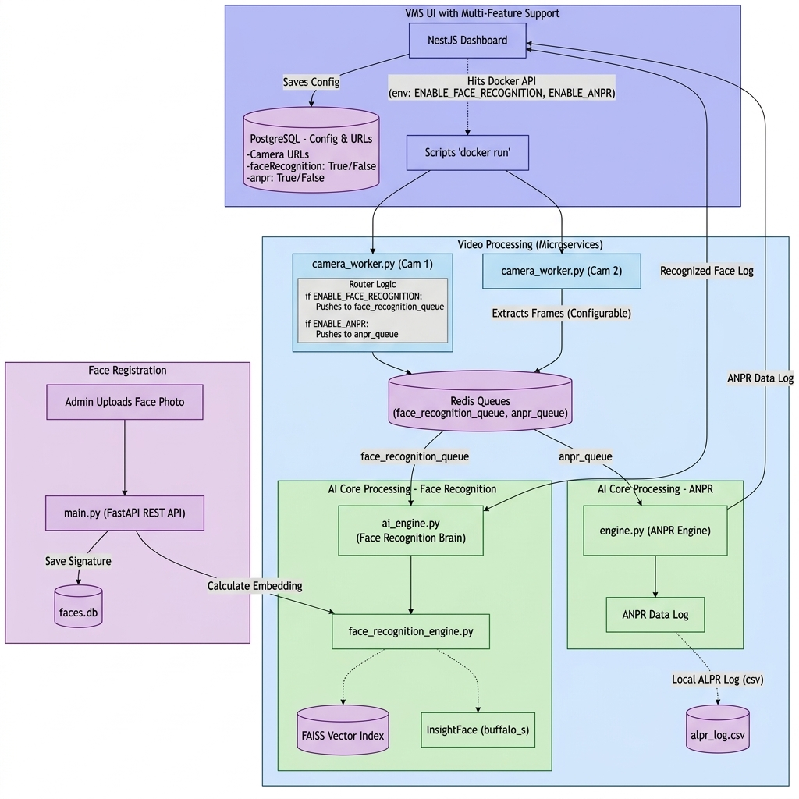
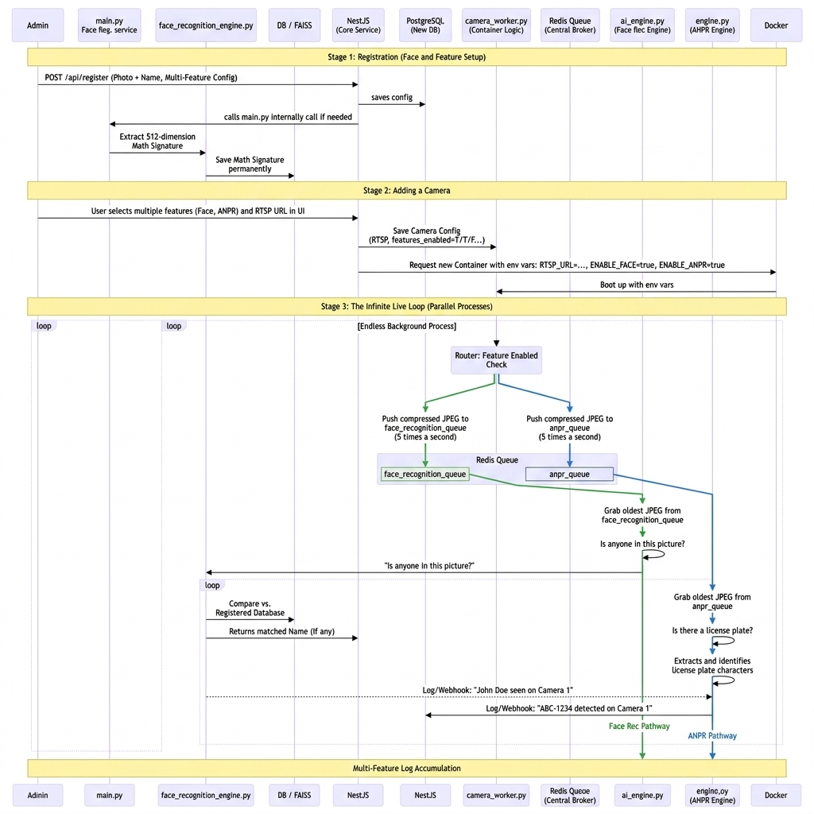

# FortiSight ANPR

FortiSight ANPR is the Automatic Number Plate Recognition module used by the wider **FortiSight video-management and analytics system**.

The service receives camera frames through Redis, detects licence plates, performs OCR, tracks plates across frames, combines repeated OCR results using character-level majority voting, stores a local audit log, posts finalized detections to the FortiSight backend, and publishes real-time recognition events.

> **Integrated face-recognition module:**  
> Face recognition is maintained in a separate repository and forms the other AI pathway in the integrated FortiSight architecture:  
> [FortiSight Face Recognition](https://github.com/ArulKevin2004/fortisight-face-recognition)

---

## Architecture

### Integrated system architecture



The complete system is designed as a multi-feature VMS:

1. Camera configuration is created in the FortiSight UI.
2. A camera worker extracts frames from each configured stream.
3. Frames are routed to feature-specific Redis queues.
4. This repository consumes frames from `anpr_queue`.
5. The separate face-recognition service consumes frames from `face_recognition_queue`.
6. Final detections are sent to the backend and surfaced in the VMS dashboard.

### Processing sequence



The sequence diagram shows the complete flow for registration, camera setup, container startup, Redis queue routing, ANPR processing, face-recognition processing, and result logging.

---

## Features

- Licence-plate detection using `fast-alpr`
- OCR using the `cct-xs-v2-global-model`
- YOLO-based plate detector
- Multiple-camera support
- Redis-backed frame ingestion
- Polygon Region of Interest support
- IoU-based plate tracking
- Plate-text re-identification
- Character-level majority voting across frames
- Best plate-crop selection
- Local CSV and debug logging
- Backend API integration
- Redis Pub/Sub detection events
- Docker deployment
- Standalone video-processing demo

---

## Repository structure

```text
fortisight-anpr/
├── architectural_diagrams/
│   ├── architecture_flowchart.png
│   └── sequence_flowchart.png
├── Dockerfile
├── engine.py
├── main.py
├── roi.json
├── roi_polygon.json.bak
├── .gitignore
└── README.md
```

Generated or local-only files such as input videos, output videos, test images, CSV logs, debug logs, virtual environments, and Python cache files are excluded through `.gitignore`.

### Main files

| File | Purpose |
|---|---|
| `engine.py` | Production/headless ANPR worker that consumes frames from Redis |
| `main.py` | Standalone local-video test script with interactive ROI selection |
| `Dockerfile` | Container image for the production ANPR worker |
| `roi.json` | Polygon coordinates used to restrict recognition to a selected area |
| `architectural_diagrams/` | Integrated architecture and sequence diagrams |

---

## Requirements

### Production worker

- Docker, or Python 3.11
- Redis
- FortiSight backend service
- Camera worker that pushes JPEG frames to `anpr_queue`

### Standalone demo

- Python 3.11 recommended
- A local input video
- Desktop environment with OpenCV window support

---

## Clone the repository

```bash
git clone https://github.com/thithikshaslt/fortisight-anpr.git
cd fortisight-anpr
```

---

## Run with Docker

### 1. Start Redis

When Redis is not already running:

```bash
docker run -d \
  --name fortisight-redis \
  -p 6379:6379 \
  redis:7-alpine
```

### 2. Build the ANPR image

```bash
docker build -t fortisight-anpr .
```

### 3. Run the ANPR worker

On macOS or Windows, where the backend runs on the host:

```bash
docker run --rm \
  --name fortisight-anpr \
  -e REDIS_URL=redis://host.docker.internal:6379/0 \
  -e BACKEND_URL=http://host.docker.internal:3000 \
  -v "$(pwd)/roi.json:/app/roi_polygon.json:ro" \
  fortisight-anpr
```

On Linux, place Redis, the backend, camera workers, and the ANPR service on the same Docker network, then use their container/service names:

```bash
docker network create fortisight-network
```

```bash
docker run -d \
  --name fortisight-redis \
  --network fortisight-network \
  redis:7-alpine
```

```bash
docker run --rm \
  --name fortisight-anpr \
  --network fortisight-network \
  -e REDIS_URL=redis://fortisight-redis:6379/0 \
  -e BACKEND_URL=http://fortisight-backend:3000 \
  -v "$(pwd)/roi.json:/app/roi_polygon.json:ro" \
  fortisight-anpr
```

Replace `fortisight-backend` with the actual backend container or service name.

---

## Run the production worker locally

Create and activate a virtual environment:

```bash
python3 -m venv .venv
source .venv/bin/activate
```

On Windows PowerShell:

```powershell
python -m venv .venv
.venv\Scripts\Activate.ps1
```

Install dependencies:

```bash
pip install opencv-python-headless redis requests fast-alpr onnxruntime numpy
```

Set the service URLs:

```bash
export REDIS_URL="redis://localhost:6379/0"
export BACKEND_URL="http://localhost:3000"
```

On Windows PowerShell:

```powershell
$env:REDIS_URL="redis://localhost:6379/0"
$env:BACKEND_URL="http://localhost:3000"
```

Start the worker:

```bash
python engine.py
```

The worker blocks while waiting for frames from `anpr_queue`.

---

## Run the standalone video demo

`main.py` is intended for local testing with a video file and an interactive OpenCV window.

Install desktop OpenCV and the required packages:

```bash
pip install opencv-python fast-alpr onnxruntime numpy
```

Place a test video in the repository and either:

- name it `sample.mp4`, or
- change `video_path` in `main.py`.

Run:

```bash
python main.py
```

### ROI controls

When no ROI file is available:

- Left-click to add polygon points.
- Press `s` to save the polygon.
- Press `c` to clear the current points.

During processing:

- Press `r` to redraw the ROI.
- Press `q` to stop.

The standalone script creates:

- `output.mp4` — annotated output video
- `alpr_log.csv` — finalized plate tracks
- `debug.log` — detailed processing log
- `roi_polygon.json` — saved polygon coordinates

These generated files should remain untracked.

---

## How the ANPR worker operates

### 1. Frame ingestion

The production worker waits on the Redis list:

```text
anpr_queue
```

Each queue item must contain:

```text
<JSON metadata bytes>|SPLIT|<JPEG image bytes>
```

Example metadata:

```json
{
  "cam_name": "Camera 1"
}
```

The camera worker is responsible for encoding frames as JPEG and pushing packets in this format.

### 2. Region of Interest

When `roi_polygon.json` is available, the engine creates a polygon mask and runs detection only inside that region.

Example:

```json
[
  [120, 250],
  [980, 250],
  [1080, 700],
  [80, 700]
]
```

Coordinates must match the resolution of the incoming camera frames.

### 3. Detection and OCR

The service uses:

```python
detector_model="yolo-v9-t-384-license-plate-end2end"
ocr_model="cct-xs-v2-global-model"
```

The production engine explicitly uses `CPUExecutionProvider` for the detector to avoid unstable zero-detection behavior observed with CoreML on macOS.

### 4. Tracking

Each detection is associated with an existing track by:

1. Exact plate-text re-identification, when OCR text is available.
2. Bounding-box Intersection over Union matching.
3. An anti-merging check that avoids combining visually overlapping vehicles whose recognized text differs substantially.

### 5. Majority voting

OCR can vary between frames. The engine:

1. Normalizes plate strings.
2. Selects the most common plate length.
3. Votes character by character.
4. Produces one final plate string for the track.

A track is finalized after it has disappeared for the configured number of frames and has accumulated enough OCR samples.

Default values in `engine.py`:

```python
IOU_THRESHOLD = 0.2
MAX_MISSED_FRAMES = 15
MIN_FRAMES_TO_FINALIZE = 5
```

### 6. Detection output

For every finalized track, the worker:

- appends a record to `alpr_log.csv`;
- selects the largest captured plate crop;
- sends a multipart request to:

```text
POST {BACKEND_URL}/api/anpr/detections
```

Form fields:

```text
cameraName
plate
timestamp
image
```

- publishes a JSON event to the Redis channel:

```text
detection_events
```

Example event:

```json
{
  "event": "plate_recognized",
  "camera": "Camera 1",
  "timestamp": "2026-07-12T10:30:00Z",
  "plate": "KA01AB1234",
  "track_id": 7,
  "imageUrl": "/uploads/plate.jpg"
}
```

### 7. Live detections

Current detections are temporarily stored for five seconds under:

```text
latest_anpr_detections:<camera-name>
```

This allows the dashboard or another service to retrieve the most recent bounding boxes, plate text, and track IDs.

---

## Integration with FortiSight Face Recognition

ANPR and face recognition are separate deployable AI services, but both belong to the same FortiSight analytics pipeline.

| Feature | Repository | Redis queue |
|---|---|---|
| ANPR | This repository | `anpr_queue` |
| Face recognition | [fortisight-face-recognition](https://github.com/ArulKevin2004/fortisight-face-recognition) | `face_recognition_queue` |

A camera worker can send the same sampled frame to one or both queues depending on the features enabled for that camera.

---

## Configuration

| Variable | Default | Description |
|---|---|---|
| `REDIS_URL` | `redis://localhost:6379/0` | Redis connection used for frame ingestion and event publishing |
| `BACKEND_URL` | `http://host.docker.internal:3000` | FortiSight backend base URL |

Tracking thresholds are currently constants inside `engine.py`.


